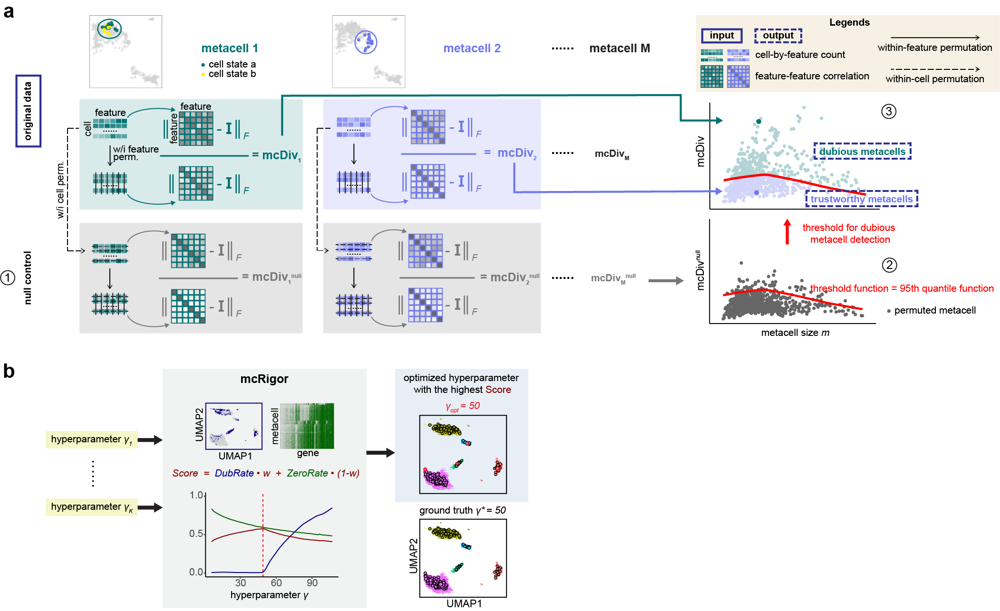
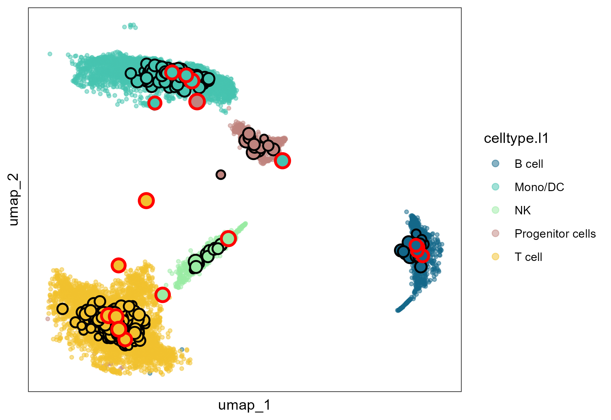

# mcRigor

The R package **mcRigor** is a statistical method to enhance the rigor of metacell partitioning in single-cell data analysis. It can be used as an add-on for any existing metacell partitioning methods for obtaining more reliable metacells. mcRigor has two main functionalities: 1) detecting dubious metacells, which are composed of heterogeneous single cells, for a given metacell partition, and 2) optimizing the hyperparameter of a metacell partitioning method. The core of mcRigor is a feature-correlation-based statistic that measures the heterogeneity of a metacell, with its null distribution derived from a double permutation scheme. The following figure illustrates the schematics of mcRigor for dubious metacell detection (a) and hyperparameter optimization (b).




## Installation<a name="installation-"></a>

To install the development version from GitHub, please run:

``` r
if (!require("devtools", quietly = TRUE))
    install.packages("devtools")
devtools::install_github("JSB-UCLA/mcRigor")
```


## Quick Start<a name="quick-start"></a>

The following code demonstrates how to implement the two main functionalities of **mcRigor** using its corresponding functions: `mcRigor_DETECT` and `mcRigor_OPTIMIZE`. For both functions, the input data should include:
- A Seurat object containing the raw single cell sequencing data.
- A dataframe specifying the metacell partitions to rectify or optimize.

An important difference between the two functions lies in their requirements of the second input: `mcRigor_DETECT` requires only a single metacell partition as input since its purpose is to detect dubious metacells within the given partition, while `mcRigor_OPTIMIZE` requires a series of metacell partitions as input since its goal is to identify the optimal partition from the provided candidates. Note that the metacell partitions can be obtained using existing metacell partitioning methods (e.g., SEACells, MetaCell, MetaCell2, SuperCell) or ad-hoc approaches. An example input is as below:

``` r
sc_dir = system.file('extdata', 'syn.rds', package = 'mcRigor')
obj_singlecell= readRDS(file = sc_dir)  # A Seurat object containing the raw scRNA-seq data

membership_dir = system.file('extdata', 'seacells_cell_membership_rna_syn.csv', package = 'mcRigor')
cell_membership_all <- read.csv(file = membership_dir, check.names = F, row.names = 1)  # A dataframe containing a series of candidate metacell partitions to optimize.
cell_membership <- cell_membership_all['50']  # A dataframe containing one metacell partition to rectify.
```

We implement the first functionality: **detecting dubious metacells**.
``` r
detect_res = mcRigor_DETECT(obj_singlecell = obj_singlecell, 
                            cell_membership = cell_membership,
                            tgamma = NULL,
                            assay_type = 'RNA',
                            feature_use = 2000,
                            aggregate_method = 'mean',
                            Nrep = 1,
                            test_cutoff = 0.05,
                            thre_smooth = TRUE,
                            thre_bw = 1/6)
detect_res$mc_res
```
The arguments of `mcRigor_DETECT()` include:
- `obj_singlecell`: A Seurat object of the original single cell sequencing data.
- `cell_membership`: A dataframe, each column of which contains the metacell membership of single cells under a given $\gamma$ (granularity level). The column names should be the corresponding $\gamma$'s (in the character type). The row names should be the single cell ids.
- `tgamma`: An integer ofthe target $\gamma$ value --- the $\gamma$ (in the character type) corresponding to the metacell partition where dubious metacells detection will be performed. tgamma has to be in the column names of cell_membership. If tgamma = NULL, dubious metacells detection will be performed on the metacell partition represented by the first column of cell_membership. Default is NULL.
- `assay_type`: A charater of the type of data assay you are using ('RNA' or 'ATAC'), depending on which different normalization would be used. Default is 'RNA'.
- `feature_use`: An integer of the number of genes to use in metacell testing. Default is 2000.
- `aggregate_method`: A character of the method to aggregate single cell profiles into metacell profiles. Default is 'mean', which means the metacell expression is computed as the mean of the single cell expression within.
- `Nrep`: An integer of the number of permutation repetitions we use when deriving the null. Default is 1.
- `test_cutoff`: A float of the test size for dubious metacell detection testing. Default is 0.05.
- `thre_smooth`: A boolean indicating whether to smooth the threshold function (lowess smoothing). Default is TRUE.
- `thre_bw`: A float. If thre_smooth is True, thre_bw specifies the bandwidth for smoothing. Default is 1/6.

The mcRigor detection results, indicating whether each metacell is classified as dubious or trustworthy, are stored in the `mc_res` field of the output object `detect_res`.

We implement the second functionality: **optimizing the hyperparameter** of a metacell partitioning method. We use SEACells as an example here.
``` r
optimize_res = mcRigor_OPTIMIZE(obj_singlecell = obj_singlecell, cell_membership = cell_membership)
```
Besides the arguments of `mcRigor_DETECT()`, `mcRigor_OPTIMIZE()` has one additional argument:
- `Gammas`: A vector of integers or characters to specify the candidate pool of granularity levels to consider in optimization. Default is NULL, which means all the granularity levels in `cell_membership` will be considered.
- `weight`: A float between 0 and 1, which sepcifies the weight for dubious rate in the tradeoff for metacell partition evaluation. Default is 0.5.

The output `optimize_res` contains the optimal granularity level (`best_granularity_level`) and the Seurat object of metacells generated under the the optimal granularity level (`opt_metacell`). We can visualize the optimal metacell partition using function  `mcRigor_projection`, with the metacells projected to the two-dimensional embedding space of single cells and the detected dubious metacells marked by red circles
``` r
opt_metacell = optimize_res$opt_metacell

sc_membership = opt_metacell@misc$cell_membership$Metacell
names(sc_membership) = rownames(opt_metacell@misc$cell_membership)

plot = mcRigor_projection(obj_singlecell = obj_singlecell, sc_membership = sc_membership,
                           color_field = 'celltype.l1',
                           dub_mc_test.label = T, test_stats = optimize_res$TabMC, Thre = optimize_res$thre)
plot
```



## Tutorials<a name="tutorials"></a>

For all detailed tutorials, please check the [website](https://jsb-ucla.github.io/mcRigor/index.html). The tutorials will demonstrate the two main functionalities of **mcRigor** on a semi-synthetic dataset of bone marrow mononuclear cells measured by CITE-seq.

-   [Functionality 1: detect dubious metacells for a given metacell partition](https://jsb-ucla.github.io/mcRigor/articles/mcRigor-detect-dubmc.html)
-   [Functionality 2: optimize metacell partitioning](https://jsb-ucla.github.io/mcRigor/articles/mcRigor-optimize.html)


## Related Paper<a name="related-manuscripts"></a>

-   **mcRigor**: [Liu, P. and Li, J.J. mcRigor: a statistical method to enhance the rigor of metacell partitioning in single-cell data analysis. <em>bioRxiv</em> (2024).](https://doi.org/10.1101/2024.10.30.621093)