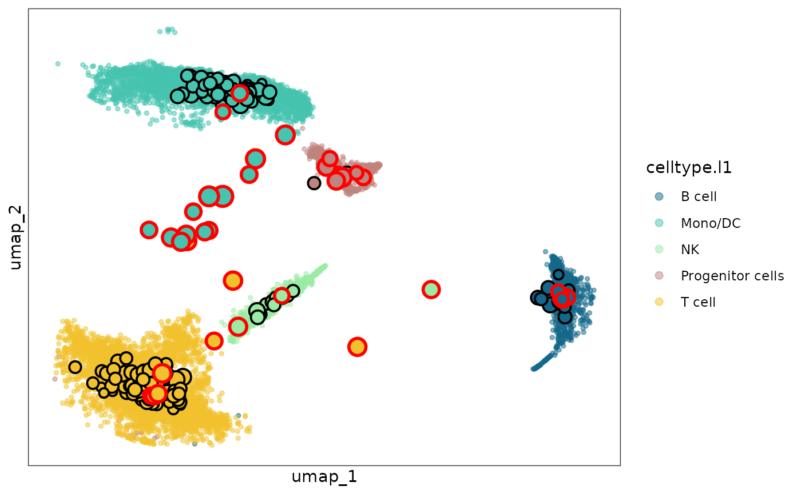

# Functionality 1: detect dubious metacells for a given metacell partition

``` r
#tools::R_user_dir("mcRigor", which="cache")
library(mcRigor)
library(Seurat)
library(ggplot2)
```

## Introduction

In this tutorial, we will show how to use mcRigor to detect dubious
metacells for a given metacell partition. We will demonstrate this
functionality of mcRigor on a semi-synthetic single cell RNA sequencing
(scRNA-seq) dataset with known ground truth trustworthiness of
metacells.

## Input preparation

Two main inputs are required for this functionality: 1. the raw
scRNA-seq data and 2. a given metacell partition generated by either
existing metacell partitioning methods or ad hoc approaches. The raw
scRNA-seq data needs to be provided as a Seurat object,
`obj_singlecell`. The semi-synthetic scRNA-seq data, whose generation
process is described in [Liu and Li,
2024](https://www.biorxiv.org/content/10.1101/2024.10.30.621093v2),
stored as a rds file `syn.rds`, is available with the mcRigor package as
an example. We first load the data.

``` r
sc_dir = system.file('extdata', 'syn.rds', package = 'mcRigor')
obj_singlecell= readRDS(file = sc_dir)
obj_singlecell
#> An object of class Seurat 
#> 2000 features across 13400 samples within 1 assay 
#> Active assay: RNA (2000 features, 2000 variable features)
#>  3 layers present: counts, data, scale.data
#>  2 dimensional reductions calculated: pca, umap
```

The metacell partition should be provided as a dataframe,
`cell_membership`, showing the assignment of single cells to metacells.
Specifically, this dataframe has only one column and each row of the
dataframe represents one single cell. The metacell partitions for the
semi-synthetic scRNA-seq data generated by the SEACells method ([Persad
et al., 2023](https://www.nature.com/articles/s41587-023-01716-9)),
stored as a csv file `seacells_cell_membership_rna_syn.csv`, is
available with the mcRigor package as an example. This csv file contains
series of metacell partitions, which were generated under different
granularity levels. Note that granularity level, $\gamma$, is a key
parameter for metacell partitioning and is defined as the ratio of the
number of single cells to the number of metacells. In this tutorial, we
focus on the metacell partition given by granularity level
$\gamma = 50$.

``` r
membership_dir = system.file('extdata', 'seacells_cell_membership_rna_syn.csv', package = 'mcRigor')
cell_membership_all <- read.csv(file = membership_dir, check.names = F, row.names = 1)
cell_membership <- cell_membership_all['50']
head(cell_membership)
#>                               50
#> 1_Cell1 mc50-allcells-SEACell-98
#> 2_Cell1 mc50-allcells-SEACell-98
#> 3_Cell1 mc50-allcells-SEACell-98
#> 4_Cell1 mc50-allcells-SEACell-98
#> 5_Cell1 mc50-allcells-SEACell-98
#> 6_Cell1 mc50-allcells-SEACell-98
```

## Detection of dubious metacells

We call the function `mcRigor_DETECT` to detect dubious metacells for
the metacell partition represented by `cell_membership`.

``` r
detect_res = mcRigor_DETECT(obj_singlecell = obj_singlecell, cell_membership = cell_membership)
```

Alternatively, we can input all metacell partitions
(`cell_membership_all`) into the function `mcRigor_DETECT` and specify
the partition of interest by setting the argument `tgamma`. The code
below indicates that we aim to detect dubious metacells for the
partition under granularity level `tgamma` = 50, while borrowing
information from other metacell partitions during null construction.
This approach is recommended when additional computation time is
acceptable, as it generally produces more stable results.

``` r
detect_res = mcRigor_DETECT(obj_singlecell = obj_singlecell, cell_membership = cell_membership_all, tgamma = 50)
```

The Seurat object of metacells are stored in the `obj_metacell` field of
the output `detect_res`.The mcRigor detection results are recorded in
the `mc_res` field of the output `detect_res` as well as the metadata of
the Seurat object with name `mcRigor`.

``` r
table(detect_res$mc_res)
#> 
#>     dubious trustworthy 
#>          39         229
obj_metacell = detect_res$obj_metacell
head(obj_metacell$mcRigor)
#>   mc50-allcells-SEACell-0   mc50-allcells-SEACell-1  mc50-allcells-SEACell-10 
#>             "trustworthy"                 "dubious"                 "dubious" 
#> mc50-allcells-SEACell-100 mc50-allcells-SEACell-101 mc50-allcells-SEACell-102 
#>             "trustworthy"             "trustworthy"             "trustworthy"
```

## Visualization

The function `mcRigor_projection` can draw the metacells projected to
the two-dimensional embedding space of single cells and mark the
detected dubious metacells

``` r
sc_membership = obj_metacell@misc$cell_membership$Metacell
names(sc_membership) = rownames(obj_metacell@misc$cell_membership)

plot = mcRigor_projection(obj_singlecell = obj_singlecell, sc_membership = sc_membership,
                           color_field = 'celltype.l1',
                           dub_mc_test.label = T, test_stats = detect_res$TabMC, Thre = detect_res$thre)
plot
```



The dubious metacells are marked by red circles while the trustworthy
metacells are with black circles.

## Session information

``` r
sessionInfo()
#> R version 4.5.3 (2026-03-11)
#> Platform: x86_64-pc-linux-gnu
#> Running under: Ubuntu 24.04.4 LTS
#> 
#> Matrix products: default
#> BLAS:   /usr/lib/x86_64-linux-gnu/openblas-pthread/libblas.so.3 
#> LAPACK: /usr/lib/x86_64-linux-gnu/openblas-pthread/libopenblasp-r0.3.26.so;  LAPACK version 3.12.0
#> 
#> locale:
#>  [1] LC_CTYPE=C.UTF-8       LC_NUMERIC=C           LC_TIME=C.UTF-8       
#>  [4] LC_COLLATE=C.UTF-8     LC_MONETARY=C.UTF-8    LC_MESSAGES=C.UTF-8   
#>  [7] LC_PAPER=C.UTF-8       LC_NAME=C              LC_ADDRESS=C          
#> [10] LC_TELEPHONE=C         LC_MEASUREMENT=C.UTF-8 LC_IDENTIFICATION=C   
#> 
#> time zone: UTC
#> tzcode source: system (glibc)
#> 
#> attached base packages:
#> [1] stats     graphics  grDevices utils     datasets  methods   base     
#> 
#> other attached packages:
#> [1] ggplot2_4.0.2      Seurat_5.4.0       SeuratObject_5.3.0 sp_2.2-1          
#> [5] mcRigor_1.0        BiocStyle_2.38.0  
#> 
#> loaded via a namespace (and not attached):
#>   [1] deldir_2.0-4           pbapply_1.7-4          gridExtra_2.3         
#>   [4] rlang_1.2.0            magrittr_2.0.5         RcppAnnoy_0.0.23      
#>   [7] otel_0.2.0             spatstat.geom_3.7-3    matrixStats_1.5.0     
#>  [10] ggridges_0.5.7         compiler_4.5.3         reshape2_1.4.5        
#>  [13] png_0.1-9              systemfonts_1.3.2      vctrs_0.7.2           
#>  [16] stringr_1.6.0          pkgconfig_2.0.3        fastmap_1.2.0         
#>  [19] labeling_0.4.3         promises_1.5.0         rmarkdown_2.31        
#>  [22] ragg_1.5.2             purrr_1.2.1            xfun_0.57             
#>  [25] cachem_1.1.0           jsonlite_2.0.0         goftest_1.2-3         
#>  [28] later_1.4.8            spatstat.utils_3.2-2   irlba_2.3.7           
#>  [31] parallel_4.5.3         cluster_2.1.8.2        R6_2.6.1              
#>  [34] ica_1.0-3              spatstat.data_3.1-9    stringi_1.8.7         
#>  [37] bslib_0.10.0           RColorBrewer_1.1-3     reticulate_1.45.0     
#>  [40] spatstat.univar_3.1-7  parallelly_1.46.1      scattermore_1.2       
#>  [43] lmtest_0.9-40          jquerylib_0.1.4        Rcpp_1.1.1            
#>  [46] bookdown_0.46          knitr_1.51             tensor_1.5.1          
#>  [49] future.apply_1.20.2    zoo_1.8-15             sctransform_0.4.3     
#>  [52] httpuv_1.6.17          Matrix_1.7-4           splines_4.5.3         
#>  [55] igraph_2.2.3           tidyselect_1.2.1       abind_1.4-8           
#>  [58] yaml_2.3.12            spatstat.random_3.4-5  spatstat.explore_3.8-0
#>  [61] codetools_0.2-20       miniUI_0.1.2           listenv_0.10.1        
#>  [64] plyr_1.8.9             lattice_0.22-9         tibble_3.3.1          
#>  [67] withr_3.0.2            shiny_1.13.0           S7_0.2.1              
#>  [70] ROCR_1.0-12            evaluate_1.0.5         Rtsne_0.17            
#>  [73] future_1.70.0          fastDummies_1.7.5      desc_1.4.3            
#>  [76] survival_3.8-6         polyclip_1.10-7        fitdistrplus_1.2-6    
#>  [79] pillar_1.11.1          BiocManager_1.30.27    KernSmooth_2.23-26    
#>  [82] plotly_4.12.0          generics_0.1.4         RcppHNSW_0.6.0        
#>  [85] scales_1.4.0           globals_0.19.1         xtable_1.8-8          
#>  [88] glue_1.8.0             lazyeval_0.2.3         tools_4.5.3           
#>  [91] data.table_1.18.2.1    RSpectra_0.16-2        RANN_2.6.2            
#>  [94] fs_2.0.1               dotCall64_1.2          cowplot_1.2.0         
#>  [97] grid_4.5.3             tidyr_1.3.2            nlme_3.1-168          
#> [100] patchwork_1.3.2        cli_3.6.5              spatstat.sparse_3.1-0 
#> [103] textshaping_1.0.5      spam_2.11-3            viridisLite_0.4.3     
#> [106] dplyr_1.2.1            uwot_0.2.4             gtable_0.3.6          
#> [109] sass_0.4.10            digest_0.6.39          progressr_0.19.0      
#> [112] ggrepel_0.9.8          htmlwidgets_1.6.4      farver_2.1.2          
#> [115] htmltools_0.5.9        pkgdown_2.2.0          lifecycle_1.0.5       
#> [118] httr_1.4.8             mime_0.13              MASS_7.3-65
```
