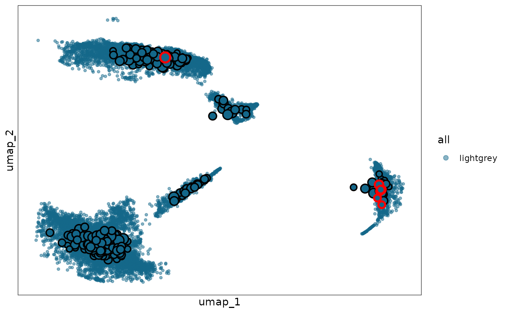

# Extension: mcRigor two-step

``` r
#tools::R_user_dir("mcRigor", which="cache")
library(mcRigor)
library(Seurat)
library(ggplot2)
```

## Introduction

### Overview

In this tutorial, we demonstrate how to use the **mcRigor two-step**
extension of **mcRigor** to further dissect previously identified
dubious metacells and reorganize their constituent cells into more
trustworthy metacells. We will apply **mcRigor two-step** to a
semi-synthetic single-cell RNA sequencing (scRNA-seq) dataset with known
ground-truth metacell trustworthiness.

As its name suggests, **mcRigor two-step** operates in two consecutive
steps:

1.  **Step 1** (function `mcRigorTS_Step1`): Identify the single cells
    that constitute dubious metacells and need to be re-partitioned.

2.  **Step 2** (function `mcRigorTS_Step2`): Re-partition the identified
    single cells under the optimized granularity level and output the
    final metacell partition.

## Input preparation

As for the main functionalities of mcRigor, we also work on two main
inputs in mcRigor two-step: 1. the raw scRNA-seq data and 2. candidate
metacell partitions generated by either existing metacell partitioning
methods or ad hoc approaches. The raw scRNA-seq data needs to be
provided as a Seurat object, `obj_singlecell`. The semi-synthetic
scRNA-seq data, whose generation process is described in [Liu and Li,
2024](https://www.biorxiv.org/content/10.1101/2024.10.30.621093v2),
stored as a rds file `syn.rds`, is available with the mcRigor package as
an example. The metacell partitions should be provided as a dataframe,
`cell_membership`, showing the assignment of single cells to metacells
in each partition. Specifically, each column of this dataframe should
represent the matacell partition corresponding to one granularity level
and each row of the dataframe should represent one single cell. Note
that we require the column namse of the dataframe to be set as the
granularity level values in the character type. The metacell partitions
for the semi-synthetic scRNA-seq data generated by the SEACells method
([Persad et al.,
2023](https://www.nature.com/articles/s41587-023-01716-9)), stored as a
csv file `seacells_cell_membership_rna_syn.csv`, is available with the
mcRigor package as an example. This csv file contains series of metacell
partitions, which were generated under different granularity levels.
Note that granularity level, $\gamma$, is a key parameter for metacell
partitioning and is defined as the ratio of the number of single cells
to the number of metacells. We first load these inputs:

``` r
sc_dir = system.file('extdata', 'syn.rds', package = 'mcRigor')
obj_singlecell= readRDS(file = sc_dir)

membership_dir = system.file('extdata', 'seacells_cell_membership_rna_syn.csv', package = 'mcRigor')
cell_membership <- read.csv(file = membership_dir, check.names = F, row.names = 1)
```

## Step 1: identify single cells that constitute the dubious metacells

In this tutorial, we focus on the metacell partition corresponding to
the granularity level $\gamma = 50$, specified by `tgamma` = 50. We
first run the main mcRigor function `mcRigor_DETECT` to check whether
this partition contains any dubious metacells. If no dubious metacells
are detected, there is no need to apply mcRigor two-step.

``` r
tgamma = 50
detect_res = mcRigor_DETECT(obj_singlecell = obj_singlecell, cell_membership = cell_membership, tgamma = tgamma)
```

``` r
table(detect_res$mc_res)
#> 
#>     dubious trustworthy 
#>          28         240
```

We proceed with mcRigor two-step because dubious metacells exist in this
partition We call the function `mcRigorTS_Step1` to identify the single
cells that constitute dubious metacells (under a lower divergence score
threshold) and need to be re-partitioned. Note that we input the
permutation results, `detect_res$TabMC`, obtained from the previous code
block to save computation time here, although it is also acceptable to
leave this argument as its default value (`NULL`). We need to specify
the metacell partitioning method (e.g., SEACells, MetaCell, MetaCell2,
SuperCell, or MetaQ) by setting the argument `method`, ensuring that the
function generates outputs in the correct format.

``` r
sc_membership = cell_membership[[as.character(tgamma)]]
names(sc_membership) = rownames(cell_membership)

step1_res = mcRigorTS_Step1(obj_singlecell = obj_singlecell, sc_membership = sc_membership, TabMC = detect_res$TabMC, method = 'seacells')
#> Testing thresholds (Thre) not provided. Calculating thresholds with defaults...
```

The Seurat object of single cells that need to be re-partitioned is
stored in the `obj_sc_dub` field of the output `step1_res`. If the
metacell partitioning method used is SEACells, MetaCell2, or MetaQ,,
`mcRigorTS_Step1` will automatically generate two CSV files
(`counts.csv` and `metadata.csv`) in the current working directory.
These files can be directly used as input for the corresponding metacell
partitioning methods in Python.

``` r
step1_res$obj_sc_dub
#> An object of class Seurat 
#> 1982 features across 2883 samples within 1 assay 
#> Active assay: RNA (1982 features, 1982 variable features)
#>  3 layers present: counts, data, scale.data
#>  2 dimensional reductions calculated: pca, umap
list.files("seacells/")
#> [1] "counts.csv"   "metadata.csv"
```

## Step 2: Re-organize the single cells into more trustworthy metacells

We then need to apply the chosen metacell partitioning method (e.g.,
SEACells, MetaCell, MetaCell2, SuperCell, MetaQ) to these identified
single cells to obtain more trustworthy metacell partitions for them,
under granularity level smaller than `tgamma` (recommend obtaining all
the candidate paritions corresponding to granularity levels from 2 to
`tgamma`-1). One can refer to the [Implementing metacell partitioning
methods](https://jsb-ucla.github.io/mcRigor/articles/mcRigor-3-mc-method.html)
tutorial for more guidnance on how to obtain the metacell partitions.
The candidate metacell partitions can be stored in csv file and read
into an R object `cell_membership_twostep` using
`cell_membership_twostep <- read.csv(file = "/path/to/the/csv/file", check.names = F, row.names = 1)`.
For illustration purpose in this tutorial, we set
`cell_membership_twostep` as the partitions corresponding to small
granularity levels in `cell_membership_all`.

``` r
cell_membership_twostep = cell_membership[ , as.numeric(names(cell_membership)) < 50]
cell_membership_twostep = cell_membership_twostep[colnames(step1_res$obj_sc_dub),]
```

We call the function `mcRigorTS_Step2` to select the optimal granularity
level and output the final metacell partition with remaining dubious
metacells flagged.

``` r
step2_res = mcRigorTS_Step2(step1_res = step1_res, obj_singlecell = obj_singlecell, cell_membership_twostep = cell_membership_twostep)
#> Names of identity class contain underscores ('_'), replacing with dashes ('-')
#> First group.by variable `Metacell` starts with a number, appending `g` to ensure valid variable names
#> This message is displayed once every 8 hours.
```

The Seurat object of the final metacells are stored in the
`obj_metacell_final` field of the output `step2_res` with the dubious
metacell detection results recorded in its metadata under the name
`mcRigor`. Another field, `obj_metacell_final_withsc`, is the Seurat
object of the final metacells where all dubious metacells have been
dissected into their constituent single cells (i.e., no dubious
metacells remain). Users can choose which object to use depending on
their analytical needs. In addtion, the output `step2_res` includes two
visualization fields: `plot` and `plot_withsc`, which correspond to UMAP
plots of single cells with `obj_metacell_final` and
`obj_metacell_final_withsc` metacells projected onto the UMAP space,
respectively.

``` r
step2_res$obj_metacell_final
#> An object of class Seurat 
#> 2000 features across 311 samples within 1 assay 
#> Active assay: RNA (2000 features, 0 variable features)
#>  2 layers present: counts, data
step2_res$plot
```



## Session information

``` r
sessionInfo()
#> R version 4.5.3 (2026-03-11)
#> Platform: x86_64-pc-linux-gnu
#> Running under: Ubuntu 24.04.4 LTS
#> 
#> Matrix products: default
#> BLAS:   /usr/lib/x86_64-linux-gnu/openblas-pthread/libblas.so.3 
#> LAPACK: /usr/lib/x86_64-linux-gnu/openblas-pthread/libopenblasp-r0.3.26.so;  LAPACK version 3.12.0
#> 
#> locale:
#>  [1] LC_CTYPE=C.UTF-8       LC_NUMERIC=C           LC_TIME=C.UTF-8       
#>  [4] LC_COLLATE=C.UTF-8     LC_MONETARY=C.UTF-8    LC_MESSAGES=C.UTF-8   
#>  [7] LC_PAPER=C.UTF-8       LC_NAME=C              LC_ADDRESS=C          
#> [10] LC_TELEPHONE=C         LC_MEASUREMENT=C.UTF-8 LC_IDENTIFICATION=C   
#> 
#> time zone: UTC
#> tzcode source: system (glibc)
#> 
#> attached base packages:
#> [1] stats     graphics  grDevices utils     datasets  methods   base     
#> 
#> other attached packages:
#> [1] ggplot2_4.0.2      Seurat_5.4.0       SeuratObject_5.3.0 sp_2.2-1          
#> [5] mcRigor_1.0        BiocStyle_2.38.0  
#> 
#> loaded via a namespace (and not attached):
#>   [1] deldir_2.0-4           pbapply_1.7-4          gridExtra_2.3         
#>   [4] rlang_1.2.0            magrittr_2.0.5         RcppAnnoy_0.0.23      
#>   [7] otel_0.2.0             spatstat.geom_3.7-3    matrixStats_1.5.0     
#>  [10] ggridges_0.5.7         compiler_4.5.3         reshape2_1.4.5        
#>  [13] png_0.1-9              systemfonts_1.3.2      vctrs_0.7.2           
#>  [16] stringr_1.6.0          pkgconfig_2.0.3        fastmap_1.2.0         
#>  [19] labeling_0.4.3         promises_1.5.0         rmarkdown_2.31        
#>  [22] ragg_1.5.2             purrr_1.2.1            xfun_0.57             
#>  [25] cachem_1.1.0           jsonlite_2.0.0         goftest_1.2-3         
#>  [28] later_1.4.8            spatstat.utils_3.2-2   irlba_2.3.7           
#>  [31] parallel_4.5.3         cluster_2.1.8.2        R6_2.6.1              
#>  [34] ica_1.0-3              spatstat.data_3.1-9    stringi_1.8.7         
#>  [37] bslib_0.10.0           RColorBrewer_1.1-3     reticulate_1.45.0     
#>  [40] spatstat.univar_3.1-7  parallelly_1.46.1      scattermore_1.2       
#>  [43] lmtest_0.9-40          jquerylib_0.1.4        Rcpp_1.1.1            
#>  [46] bookdown_0.46          knitr_1.51             tensor_1.5.1          
#>  [49] future.apply_1.20.2    zoo_1.8-15             sctransform_0.4.3     
#>  [52] httpuv_1.6.17          Matrix_1.7-4           splines_4.5.3         
#>  [55] igraph_2.2.2           tidyselect_1.2.1       abind_1.4-8           
#>  [58] yaml_2.3.12            spatstat.random_3.4-5  spatstat.explore_3.8-0
#>  [61] codetools_0.2-20       miniUI_0.1.2           listenv_0.10.1        
#>  [64] plyr_1.8.9             lattice_0.22-9         tibble_3.3.1          
#>  [67] withr_3.0.2            shiny_1.13.0           S7_0.2.1              
#>  [70] ROCR_1.0-12            evaluate_1.0.5         Rtsne_0.17            
#>  [73] future_1.70.0          fastDummies_1.7.5      desc_1.4.3            
#>  [76] survival_3.8-6         polyclip_1.10-7        fitdistrplus_1.2-6    
#>  [79] pillar_1.11.1          BiocManager_1.30.27    KernSmooth_2.23-26    
#>  [82] plotly_4.12.0          generics_0.1.4         RcppHNSW_0.6.0        
#>  [85] scales_1.4.0           globals_0.19.1         xtable_1.8-8          
#>  [88] glue_1.8.0             lazyeval_0.2.3         tools_4.5.3           
#>  [91] data.table_1.18.2.1    RSpectra_0.16-2        RANN_2.6.2            
#>  [94] fs_2.0.1               dotCall64_1.2          cowplot_1.2.0         
#>  [97] grid_4.5.3             tidyr_1.3.2            nlme_3.1-168          
#> [100] patchwork_1.3.2        cli_3.6.5              spatstat.sparse_3.1-0 
#> [103] textshaping_1.0.5      spam_2.11-3            viridisLite_0.4.3     
#> [106] dplyr_1.2.1            uwot_0.2.4             gtable_0.3.6          
#> [109] sass_0.4.10            digest_0.6.39          progressr_0.19.0      
#> [112] ggrepel_0.9.8          htmlwidgets_1.6.4      farver_2.1.2          
#> [115] htmltools_0.5.9        pkgdown_2.2.0          lifecycle_1.0.5       
#> [118] httr_1.4.8             mime_0.13              MASS_7.3-65
```
